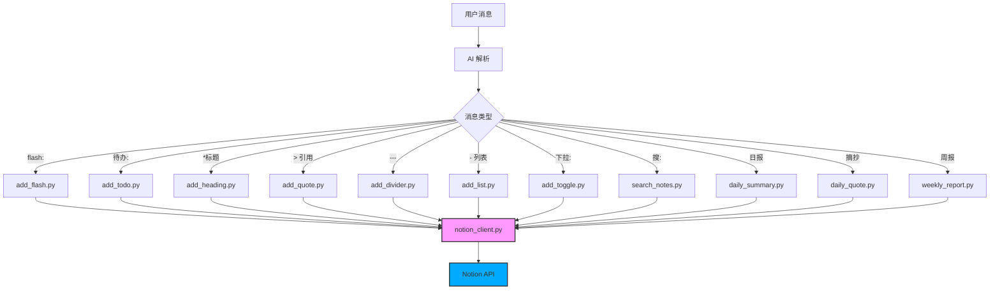

# Notion IM Helper — 项目完成总结

## 📁 完整文件结构

```
notion-IM-helper/
├── SKILL.md                    # 技能定义（AI 操作手册）— 460 行
└── scripts/                    # Python 脚本
    ├── notion_client.py        # 核心公共模块 — 14.3 KB
    ├── check_config.py         # 配置检查
    ├── add_flash.py            # 添加闪念（段落+时间戳+分割线）
    ├── add_todo.py             # 添加待办（支持 --done）
    ├── add_heading.py          # 添加标题（H1/H2/H3）
    ├── add_quote.py            # 添加引用块
    ├── add_divider.py          # 添加分割线
    ├── add_list.py             # 添加列表（bullet/number）
    ├── add_toggle.py           # 添加多级下拉列表（stdin JSON）
    ├── search_notes.py         # 搜索笔记（只读）
    ├── daily_summary.py        # 每日汇总（只读）
    ├── daily_quote.py          # 随机摘抄（只读）
    └── weekly_report.py        # 周报生成（只读）
```

## 🏗️ 架构设计



## 🔧 核心模块 [notion_client.py](file:///S:/Program%20Files/QClaw/resources/openclaw/config/skills/notion-IM-helper/scripts/notion_client.py) 提供

| 功能 | 函数 | 说明 |
|------|------|------|
| **Block 构建器** | [make_paragraph_block()](file:///S:/Program%20Files/QClaw/resources/openclaw/config/skills/notion-IM-helper/scripts/notion_client.py#210-220) [make_heading_block()](file:///S:/Program%20Files/QClaw/resources/openclaw/config/skills/notion-IM-helper/scripts/notion_client.py#222-232) [make_todo_block()](file:///S:/Program%20Files/QClaw/resources/openclaw/config/skills/notion-IM-helper/scripts/notion_client.py#234-244) [make_quote_block()](file:///S:/Program%20Files/QClaw/resources/openclaw/config/skills/notion-IM-helper/scripts/notion_client.py#246-255) [make_divider_block()](file:///S:/Program%20Files/QClaw/resources/openclaw/config/skills/notion-IM-helper/scripts/notion_client.py#257-264) [make_bulleted_list_block()](file:///S:/Program%20Files/QClaw/resources/openclaw/config/skills/notion-IM-helper/scripts/notion_client.py#266-278) [make_numbered_list_block()](file:///S:/Program%20Files/QClaw/resources/openclaw/config/skills/notion-IM-helper/scripts/notion_client.py#280-292) [make_toggle_block()](file:///S:/Program%20Files/QClaw/resources/openclaw/config/skills/notion-IM-helper/scripts/notion_client.py#294-306) | 8 种 Notion Block 类型 |
| **页面操作** | [append_blocks()](file:///S:/Program%20Files/QClaw/resources/openclaw/config/skills/notion-IM-helper/scripts/notion_client.py#312-326) [list_blocks()](file:///S:/Program%20Files/QClaw/resources/openclaw/config/skills/notion-IM-helper/scripts/notion_client.py#332-346) [list_all_blocks()](file:///S:/Program%20Files/QClaw/resources/openclaw/config/skills/notion-IM-helper/scripts/notion_client.py#348-359) | 追加 / 读取内容块 |
| **搜索** | [search_pages()](file:///S:/Program%20Files/QClaw/resources/openclaw/config/skills/notion-IM-helper/scripts/notion_client.py#365-377) | 全局搜索 |
| **错误处理** | [api_call_with_retry()](file:///S:/Program%20Files/QClaw/resources/openclaw/config/skills/notion-IM-helper/scripts/notion_client.py#134-190) | 自动重试（429）、认证错误映射 |
| **输出协议** | [output_ok()](file:///S:/Program%20Files/QClaw/resources/openclaw/config/skills/notion-IM-helper/scripts/notion_client.py#58-61) [output_error()](file:///S:/Program%20Files/QClaw/resources/openclaw/config/skills/notion-IM-helper/scripts/notion_client.py#63-69) [log_debug()](file:///S:/Program%20Files/QClaw/resources/openclaw/config/skills/notion-IM-helper/scripts/notion_client.py#71-74) | 统一 `OK\|` / `ERROR\|` 输出 |
| **参数解析** | [parse_metadata_args()](file:///S:/Program%20Files/QClaw/resources/openclaw/config/skills/notion-IM-helper/scripts/notion_client.py#397-417) [build_metadata_suffix()](file:///S:/Program%20Files/QClaw/resources/openclaw/config/skills/notion-IM-helper/scripts/notion_client.py#419-427) | 解析 `--tag` `--project` |
| **工具** | [normalize_page_id()](file:///S:/Program%20Files/QClaw/resources/openclaw/config/skills/notion-IM-helper/scripts/notion_client.py#39-52) [get_timestamp()](file:///S:/Program%20Files/QClaw/resources/openclaw/config/skills/notion-IM-helper/scripts/notion_client.py#383-386) [get_today_str()](file:///S:/Program%20Files/QClaw/resources/openclaw/config/skills/notion-IM-helper/scripts/notion_client.py#388-391) | 页面 ID 标准化、时间工具 |

## ✅ 已完成

- [x] SKILL.md — 完整的 AI 操作手册（核心原则、触发条件、解析规则、输出协议、注意事项）
- [x] 核心公共模块 [notion_client.py](file:///S:/Program%20Files/QClaw/resources/openclaw/config/skills/notion-IM-helper/scripts/notion_client.py) — 封装所有 Notion API 交互
- [x] 8 个写入脚本 — 闪念、待办、标题、引用、分割线、列表、下拉列表
- [x] 4 个查询脚本 — 搜索、日报、摘抄、周报
- [x] 配置检查脚本 [check_config.py](file:///S:/Program%20Files/QClaw/resources/openclaw/config/skills/notion-IM-helper/scripts/check_config.py)
- [x] 全部脚本语法检查通过

## 📋 后续可选

- [ ] 创建 [_meta.json](file:///S:/Program%20Files/QClaw/resources/openclaw/config/skills/imap-smtp-email/_meta.json)（发布到 OpenClaw 市场时需要）
- [ ] 安装 `notion-client` 依赖（`pip install notion-client`）
- [ ] 配置环境变量并进行端到端测试
- [ ] 添加单元测试
